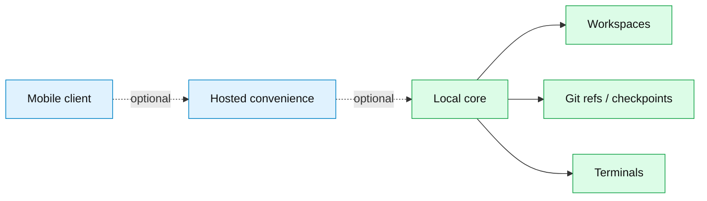
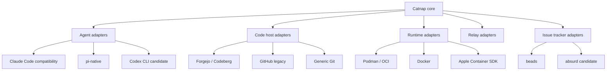

# Catnap Fork Manifesto

Catnap is a temporary codename for a Catnip-derived project.

Catnip proved a powerful idea: coding agents work better when they run in isolated, git-backed workspaces with terminals, previews, checkpoints, and remote control surfaces. That idea should outlive any one AI provider, code host, cloud vendor, or corporate owner.

Catnap exists to preserve and evolve that idea as a community-shaped, vendor-neutral agent workspace manager.

## Why fork direction matters

Catnip's current implementation leans toward a few convenient defaults: Claude Code, GitHub/Codespaces, Cloudflare-hosted `catnip.run`, W&B branding, and App Store distribution. These choices made the product real. They also create long-term trust questions.

The concern is not that every vendor integration is bad. The concern is that a project for running long-lived development workflows should not be hostage to one vendor's roadmap, acquisition, pricing model, auth policy, or shutdown decision.

Local Catnip already has a strong foundation: `catnip run` does not depend on `catnip.run` for core local use. Catnap should make that property explicit and preserve it as a principle.

## What Catnap inherits

Catnap inherits these ideas from Catnip:

- one command starts an agent-friendly dev environment
- each agent gets an isolated workspace
- git worktrees and refs are the durable state model
- terminal access is first-class
- previewing agent-started services should be automatic
- mobile and remote control are valuable convenience layers
- parallel agent work should be organized, reviewable, and recoverable

Catnap does not inherit vendor assumptions as project identity.

## Core commitments

### 1. Local-first before hosted convenience

The core product must run locally without a hosted control plane.

Hosted services may wake, route, sync metadata, or improve mobile access. They must not own workspace state or become required for normal local use.

### 2. Adapters over lock-in

Catnap should integrate with many providers through explicit adapters.

Adapters are welcome. Hidden dependencies are not.

### 3. Community-led defaults

Catnap should prefer infrastructure created by non-profit, community-led, or FOSS-aligned efforts when trade-offs are reasonable.

This is a preference, not purity law. Proprietary services can be supported when they are useful and replaceable.

Provisional defaults:

- Forgejo / Codeberg before GitHub
- beads as issue tracker, with absurd as possible adapter
- OCI-compatible runtimes, with Podman first-class
- direct SSH or self-hosted tunnels before SaaS-only relays
- Forgejo Actions or Woodpecker before GitHub Actions
- repo-local ADRs/RFCs for decisions

Each default needs a focused deep dive before becoming policy.

### 4. Corporate contributors welcome, single-vendor control not welcome

Companies can fund, contribute, host, and maintain adapters. No company should be able to unilaterally define the project's future.

Governance should be legible in the repo:

- decisions recorded as ADRs or RFCs
- adapter acceptance criteria written down
- defaults changed through reviewable proposals
- project direction discussed in public artifacts

### 5. Rich agent integrations without agent monoculture

Catnap should not reduce every agent to a generic chat completion API. Coding agents have terminals, tools, resumes, permissions, transcripts, and quirks.

The right abstraction is an agent session lifecycle adapter:

- start
- resume
- attach
- parse events
- report status
- expose transcript
- trigger checkpoints

Claude Code compatibility matters because it is the lineage. pi matters because it can be a provider-flexible path. Codex CLI may matter after the contract stabilizes.

### 6. Git is the durable substrate

Agent work should remain inspectable with normal git tools.

Workspaces, branches, checkpoint refs, and reviews should not depend on a web database as source of truth. Hosted metadata can help humans navigate work, but git carries the work.

## What Catnap refuses

Catnap should reject designs where:

- local use requires a SaaS login
- one AI provider is hardcoded into core models and UI language
- GitHub-only URL parsing defines the domain model
- mobile access only works through one hosted domain
- workspace state is trapped in a cloud backend
- community forks must ask a corporation for operational continuity

## Compatibility without captivity

Catnap should support existing Catnip users where possible:

- Claude Code compatibility adapter
- GitHub adapter
- Cloudflare/catnip.run legacy hosted adapter if maintained
- Docker support
- existing workspace/git state migration

Compatibility is a bridge. It is not the destination.

## North-star sentence

Catnap is a local-first, git-backed, vendor-neutral workspace manager for coding agents, with optional hosted convenience and replaceable adapters for agents, forges, runtimes, relays, and issue trackers.

## Name status

Catnap is a codename. It is intentionally playful and temporary. Final naming should wait until ownership, trademark risk, governance, and community identity are settled.
