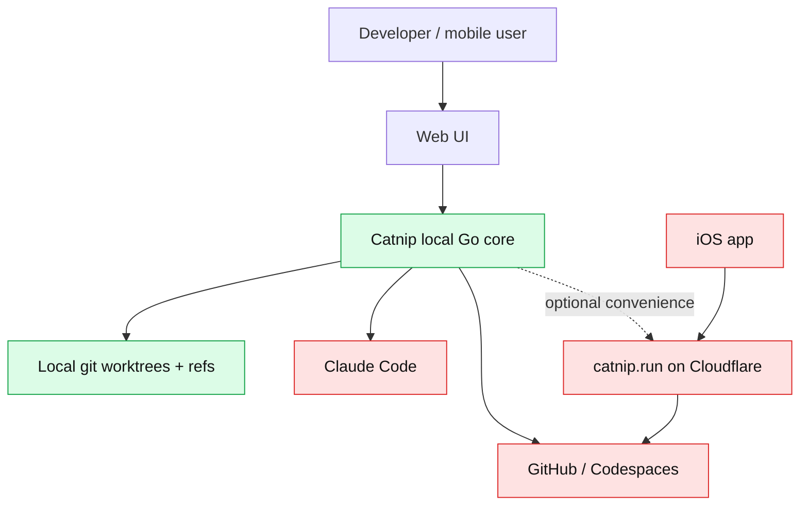
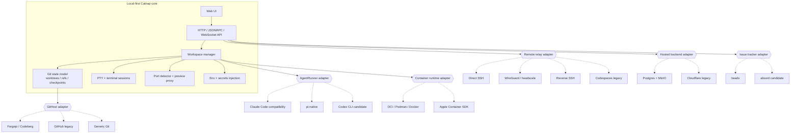
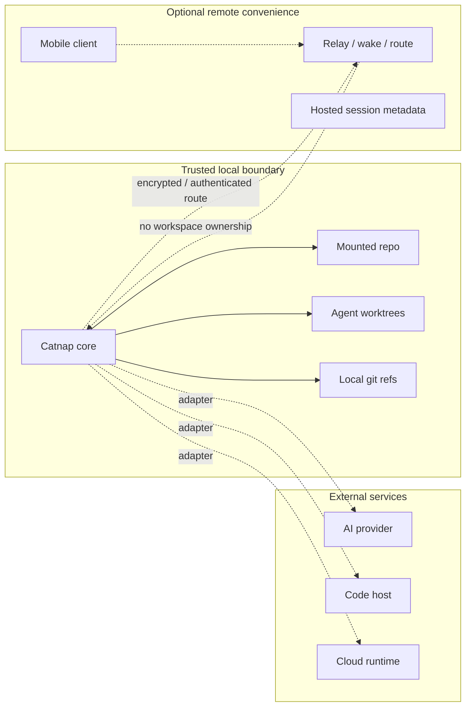
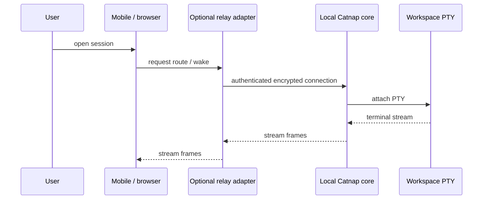
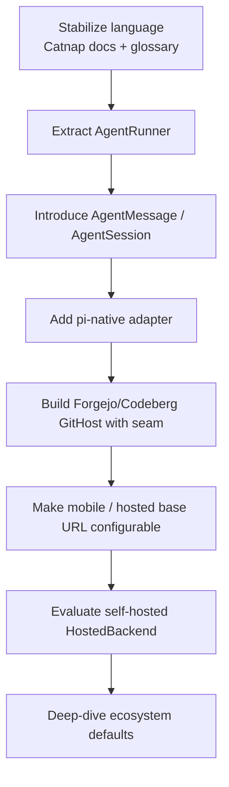

# Catnap Vendor-Neutral Architecture

Catnap is the temporary codename for a Catnip-derived agent workspace manager whose core value survives changes in AI providers, code hosts, cloud runtimes, and corporate sponsors.

This document is a north-star architecture, not a migration checklist. It records the desired shape: a local-first core surrounded by explicit adapters.

## Design goals

- Keep the **local core** useful without any hosted service.
- Treat AI agents, code hosts, relays, identity providers, and storage backends as adapters.
- Preserve Catnip's strongest idea: isolated git-backed workspaces for parallel coding agents.
- Prefer FOSS, community-led, or non-profit infrastructure where practical.
- Allow proprietary integrations only when they are optional and replaceable.

## Non-negotiable independence boundaries

Catnap core must not require:

- W&B or CoreWeave services
- Anthropic or Claude Code
- GitHub or Codespaces
- Cloudflare
- Apple Container SDK
- A proprietary mobile app store path

These can exist as adapters. They must not be the only path.

## Current risk map

Key observation from architecture review: local `catnip run` is not load-bearing on `catnip.run`. If hosted services disappear, the local product continues. The blast radius is mainly mobile and Codespaces convenience.

## Target architecture

## Trust boundaries

Rule: remote convenience layers route, wake, and observe. They do not own workspace state.

## Adapter priorities

| Seam                            | Priority | Status          | Why                                                                                                                                      |
| ------------------------------- | -------: | --------------- | ---------------------------------------------------------------------------------------------------------------------------------------- |
| `AgentRunner`                   |        1 | Strong          | Claude plus the intended Pi adapter imply multiple agents. This directly de-risks Anthropic coupling without depending on Google/Gemini. |
| `AgentMessage` / `AgentSession` |        1 | Strong          | Claude-shaped events and fields leak into UI consumers. Pair with `AgentRunner` to avoid double churn.                                   |
| `GitHost`                       |        2 | Worth exploring | GitHub assumptions exist, but only one host is real today. Build seam with Forgejo/Codeberg adapter, not before.                         |
| `HostedBackend`                 |        3 | Worth exploring | Cloudflare/catnip.run affects convenience tier. Local core survives. Early cheap win: configurable mobile base URL.                      |
| `IssueTracker`                  |        3 | Low-risk        | beads remains default; absurd can be explored as adapter.                                                                                |

## Agent session contract

Catnap should abstract agent session lifecycle, not invent a universal LLM API.

Core owns:

- workspace allocation
- environment and secrets injection
- PTY/process lifecycle
- transcript and event capture
- checkpoint triggers
- title/task extraction contract
- permission and sandbox policy

Agent adapters own:

- executable or SDK invocation
- resume/continue semantics
- auth flow and OAuth capture
- output parsing into common events

Initial target adapters:

1. Claude Code compatibility adapter, preserving existing behavior.
2. pi-native adapter, preferred for long-term provider flexibility.
3. Codex CLI candidate adapter after the session contract stabilizes.

pi is an adapter, not a core dependency.

## Git and forge contract

Core git behavior stays forge-neutral:

- worktree creation
- workspace refs
- checkpoint commits
- branch synchronization
- built-in git server
- clone/fetch/push primitives

Forge adapters own optional features:

- PR/MR creation
- repo discovery
- OAuth/device auth
- Codespace/dev-environment wakeups
- provider-specific URL parsing

Default direction: Forgejo/Codeberg first, GitHub legacy supported, Generic Git always available.

## Remote access contract

Catnap is local-first with optional relays.

Relay constraint: no relay should be required for localhost or direct SSH use.

## Provisional default ecosystem

These defaults are directional and need deeper design per line item.

| Area           | Provisional default                        | Other adapters                                      |
| -------------- | ------------------------------------------ | --------------------------------------------------- |
| Code host      | Forgejo / Codeberg                         | GitHub, GitLab CE, Generic Git                      |
| Issue tracker  | beads                                      | absurd candidate                                    |
| Runtime        | OCI-compatible runtime, Podman first-class | Docker, Apple Container SDK                         |
| Remote access  | Direct SSH / self-hosted tunnel            | WireGuard/headscale, reverse SSH, Codespaces legacy |
| CI             | Forgejo Actions or Woodpecker              | GitHub Actions adapter                              |
| Hosted backend | Self-hosted Postgres + MinIO               | Cloudflare legacy                                   |
| Decisions      | ADRs/RFCs in repo                          | none                                                |

## Migration priority flow

## Open design questions

- What is the minimum `AgentRunner` interface that supports Claude Code and pi without overfitting either?
- What common `AgentMessage` shape preserves rich tool output without turning into a lowest-common-denominator blob?
- Which Forgejo/Codeberg flows matter first: clone, auth, PR/MR creation, or remote workspace wakeup?
- Should hosted convenience be one deployable service or several small optional services?
- What governance body or process owns adapter acceptance and default changes?
